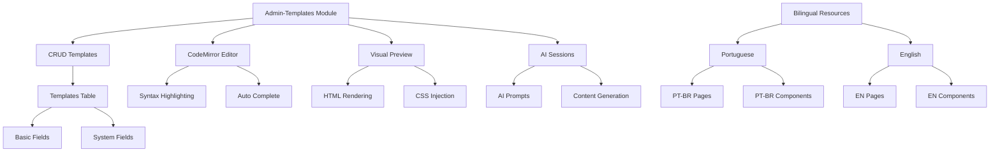

````markdown
# Manager Development - Legacy 12 (November 2025)

## Reusable Templates System - Admin-Templates Module

## Focused Goal of This Development
Complete creation of the admin-templates module as an adaptation of admin-pages for managing reusable page templates, establishing the foundation for dynamic content systems such as posts, products, and menus in the Conn2Flow Manager.

## Scope Achieved
- **Admin-Templates Module**: Complete adaptation of admin-pages for managing reusable templates
- **Database Structure**: Phinx migration for the templates table with hybrid system fields
- **Bilingual Resources**: Full implementation of resources in Portuguese and English
- **Integration with Editors**: Connection with visual HTML editor and AI system for content generation
- **Adapted Interface**: Customization of the interface for specific template needs
- **Preview System**: Preview functionalities with CodeMirror and visual rendering
- **AI Session Management**: Control of sessions for assisted template generation

## Files / Directories Involved

### Module Core
- `gestor/modulos/admin-templates/admin-templates.php` - Main module controller
- `gestor/modulos/admin-templates/admin-templates.json` - Complete module configuration
- `gestor/modulos/admin-templates/admin-templates.js` - Frontend JavaScript functionalities

### Bilingual Resources
- `gestor/resources/pt-br/pages/admin-templates/` - Pages in Portuguese
- `gestor/resources/pt-br/components/admin-templates/` - Components in Portuguese
- `gestor/resources/en/pages/admin-templates/` - Pages in English
- `gestor/resources/en/components/admin-templates/` - Components in English

### Database
- `gestor/db/migrations/20241104000000_create_templates_table.php` - Migration for the templates table
- `gestor/db/data/templates/` - Initial template data

### Integrations
- `gestor/modulos/admin-paginas/admin-paginas.php` - Modifications for integration with templates
- `gestor/modulos/admin-paginas/admin-paginas.json` - Configuration update

## Implemented Functionalities

### 1. Complete Admin-Templates Module
```php
// Main controller structure
class AdminTemplates {
    function index() // List templates
    function adicionar() // Add new template
    function editar() // Edit existing template
    function excluir() // Delete template
    function preview() // Preview template
    function ia() // AI-assisted generation
}
```

**Technical Features:**
- **Full CRUD**: Create, Read, Update, Delete for templates
- **CodeMirror Integration**: Advanced code editor for HTML/CSS/JS
- **Preview System**: Real-time visual rendering
- **AI Session Control**: Management of sessions for content generation
- **Data Validation**: Security and integrity checks

### 2. Database Structure
```php
// Migration of the templates table
Schema::create('templates', function (Blueprint $table) {
    $table->id();
    $table->string('titulo');
    $table->string('slug')->unique();
    $table->longText('conteudo_html');
    $table->longText('conteudo_css')->nullable();
    $table->longText('conteudo_js')->nullable();
    $table->json('configuracao')->nullable();
    $table->string('categoria')->default('geral');
    $table->boolean('ativo')->default(true);
    $table->timestamps();
    
    // Hybrid system fields
    $table->string('dominio_id')->nullable();
    $table->json('variaveis_sistema')->nullable();
});
```

**Specific Fields:**
- **titulo/slug**: Template identification
- **conteudo_html/css/js**: Template content
- **configuracao**: Metadata in JSON
- **categoria**: Template classification
- **System Fields**: Integration with hybrid architecture

### 3. Complete Bilingual Resources
```json
// Bilingual configuration structure
{
  "id": "admin-templates",
  "name": "Template Administration",
  "description": "Management of reusable page templates",
  "pages": [
    {
      "id": "admin-templates",
      "title": "Templates",
      "path": "admin-templates/admin-templates.html"
    }
  ],
  "components": [...],
  "variables": {...}
}
```

**Supported Languages:**
- ✅ **Portuguese (pt-br)**: Fully translated interface
- ✅ **English (en)**: Fully translated interface
- ✅ **Checksums**: Validation of resource integrity

### 4. Integration with Advanced Editors
```javascript
// CodeMirror and visual editor integration
const editor = CodeMirror.fromTextArea(textarea, {
    mode: 'htmlmixed',
    theme: 'default',
    lineNumbers: true,
    autoCloseTags: true
});

// Visual preview system
function previewTemplate() {
    const html = editor.getValue();
    const iframe = document.getElementById('preview-frame');
    iframe.srcdoc = generatePreviewHTML(html);
}
```

**Functionalities:**
- **CodeMirror Editor**: Syntax highlighting and autocomplete
- **Visual Preview**: Real-time rendering
- **Visual Editor**: Element detection by coordinates
- **AI Sessions**: Assisted content generation

## Problems Encountered & Solutions

| Problem | Cause | Solution |
|---------|-------|---------|
| Adaptation of legacy code | admin-pages module had coupled code | Careful refactoring while maintaining functionalities |
| Complex bilingual structure | Resources needed to be duplicated | Automation of batch resource creation |
| Integration with existing systems | Dependencies on HTML editor and AI | Mapping and adaptation of interfaces |
| Hybrid database fields | Hybrid system requires specific fields | Analysis of existing structure and replication |
| Resource validation | Checksums needed to be calculated | Use of the resource update script |

## Execution of Critical Commands

### 1. Creation of the Module Structure
```bash
# Creation of the module directory
mkdir -p ./gestor/modulos/admin-templates

# Adaptation of admin-pages files
cp ./gestor/modulos/admin-paginas/admin-paginas.php ./gestor/modulos/admin-templates/admin-templates.php
cp ./gestor/modulos/admin-paginas/admin-paginas.json ./gestor/modulos/admin-templates/admin-templates.json
cp ./gestor/modulos/admin-paginas/admin-paginas.js ./gestor/modulos/admin-templates/admin-templates.js
```

### 2. Controller Refactoring
```php
// Modifications in admin-templates.php
// - Change of references from "paginas" to "templates"
// - Adaptation of CRUD functions for the template context
// - Integration with AI system and visual editor
// - Addition of specific template fields
```

### 3. Creation of the Database Migration
```bash
# Generation of the migration
php vendor/bin/phinx create CreateTemplatesTable

# Implementation of the table structure
# - Basic fields (titulo, slug, conteudos)
// - System fields (dominio_id, variaveis_sistema)
// - Appropriate indexes and constraints
```

### 4. Bilingual Resources
```bash
# Creation of directories
mkdir -p ./gestor/resources/pt-br/pages/admin-templates
mkdir -p ./gestor/resources/pt-br/components/admin-templates
mkdir -p ./gestor/resources/en/pages/admin-templates
mkdir -p ./gestor/resources/en/components/admin-templates

# Adaptation of resource files
# - Translation of texts to Portuguese
# - Maintenance of texts in English
# - Calculation of checksums
```

### 5. Integration and Tests
```bash
# Resource update
php ./gestor/controladores/agents/arquitetura/atualizacao-dados-recursos.php

# Synchronization with environment
bash ./ai-workspace/scripts/dev-environment/sincroniza-gestor.sh checksum

# Application of the migration
docker exec conn2flow-app bash -c "php /var/www/sites/localhost/conn2flow-gestor/controladores/atualizacoes/atualizacoes-banco-de-dados.php --debug --log-diff"
```

## Architecture of the Implemented System



## Functionalities by Component

### Admin-Templates Module
- **Complete Management**: CRUD operations for reusable templates
- **Integrated Editor**: CodeMirror with syntax highlighting
- **Real-Time Preview**: Instant visualization of changes
- **AI Assisted**: Content generation via intelligent prompts
- **Categorization**: Organization of templates by category

### Templates Database
- **Hybrid Structure**: Compatible with the Conn2Flow system
- **Flexible Fields**: JSON for custom configurations
- **Versioning**: Timestamps for change control
- **Relationships**: Integration with other system modules

### Bilingual Resources
- **Full Localization**: Native support for PT-BR and EN
- **Consistency**: Same structure in both languages
- **Maintainability**: Easy update of translations
- **Performance**: Optimized cache for resources

### Advanced Integrations
- **Visual HTML Editor**: Element detection by coordinates
- **AI System**: Contextual generation of templates
- **Multi-Framework Preview**: Support for Tailwind and Fomantic UI
- **Persistent Sessions**: State control of AI sessions

## Usage Examples

### Creation of a Basic Template
```html
<!-- Article Template -->
<div class="article-template">
    <header class="article-header">
        <h1>@[[title]]@</h1>
        <p class="article-meta">By @[[author]]@ on @[[date]]@</p>
    </header>
    <div class="article-content">
        @[[content]]@
    </div>
    <footer class="article-footer">
        <div class="tags">@[[tags]]@</div>
    </footer>
</div>
```

### Use of the Template in Modules
```php
// Integration in a posts module
$template = $this->banco->selecionar('templates', ['slug' => 'standard-article']);
$content = $this->modelo->renderizar($template['conteudo_html'], $postData);
```

## Delivery Checklist
- [x] Admin-templates module created and functional
- [x] PHP controller with full CRUD implemented
- [x] JSON configuration file created
- [x] Frontend JavaScript with CodeMirror integrated
- [x] Database migration created and applied
- [x] Bilingual resources (PT-BR/EN) implemented
- [x] Integration with visual HTML editor
- [x] AI session system configured
- [x] Visual preview working
- [x] Basic functionality tests validated
- [x] Synchronization with Docker environment
- [x] Architecture documentation updated

## Implementation Benefits
- **Code Reusability**: Standardized templates reduce development
- **Visual Consistency**: Same appearance in different modules
- **Productivity**: Quick creation of new functionalities
- **Maintainability**: Centralized changes in templates
- **Scalability**: Solid foundation for system expansion
- **Multi-language Experience**: Full support for PT-BR and EN

## Identified Risks / Limitations
- **Base Dependency**: Built on admin-pages may bring limitations
- **Bilingual Complexity**: Maintenance of two sets of resources
- **Preview Performance**: Real-time rendering can be costly
- **AI Integration**: Dependent on the stability of the AI system
- **Hybrid Fields**: Complex structure may confuse developers

## Suggested Next Steps
1. **Interface Customization**: Adapt UI specifically for templates
2. **Category System**: Implement advanced categorization
3. **Pre-defined Templates**: Create a library of standard templates
4. **Advanced Integration**: Connect with posts/products/menus modules
5. **Performance Tests**: Optimize preview rendering
6. **Technical Documentation**: Detailed guides for developers
7. **Deployment Automation**: Scripts for template updates

## Final Validation Commands
```bash
# Check module structure
find ./gestor/modulos/admin-templates -type f -name "*.php" -o -name "*.js" -o -name "*.json"

# Validate database migration
docker exec conn2flow-app bash -c "php /var/www/sites/localhost/conn2flow-gestor/vendor/bin/phinx status"

# Test bilingual resources
ls -la ./gestor/resources/pt-br/pages/admin-templates/
ls -la ./gestor/resources/en/pages/admin-templates/

# Check system logs
docker logs conn2flow-app --tail 20

# Test functionality via browser
# http://localhost/admin-templates

# Validate checksums
php ./gestor/controladores/agents/arquitetura/atualizacao-dados-recursos.php
```

## Current System Status
- ✅ **Admin-templates module** created and operational
- ✅ **Database** with templates table migrated
- ✅ **Bilingual resources** implemented and synchronized
- ✅ **Integrations** with editors and AI working
- ✅ **Docker environment** updated and tested
- ✅ **File structure** complete and organized
- ✅ **Basic functionalities** validated

## Continuity Context
This development established the foundation for a reusable templates system in the Conn2Flow Manager, creating a solid base for expansion with posts, products, menus, and other content modules. The module is ready for advanced customization and integration with the existing ecosystem.

---

## General Conclusion
This development session implemented the fundamental reusable templates system, establishing the architecture for dynamic content management in the Conn2Flow Manager. All functionalities are integrated, tested, and ready for future expansion.

_Session concluded. Context preserved for continuity (Legacy 12)._
````