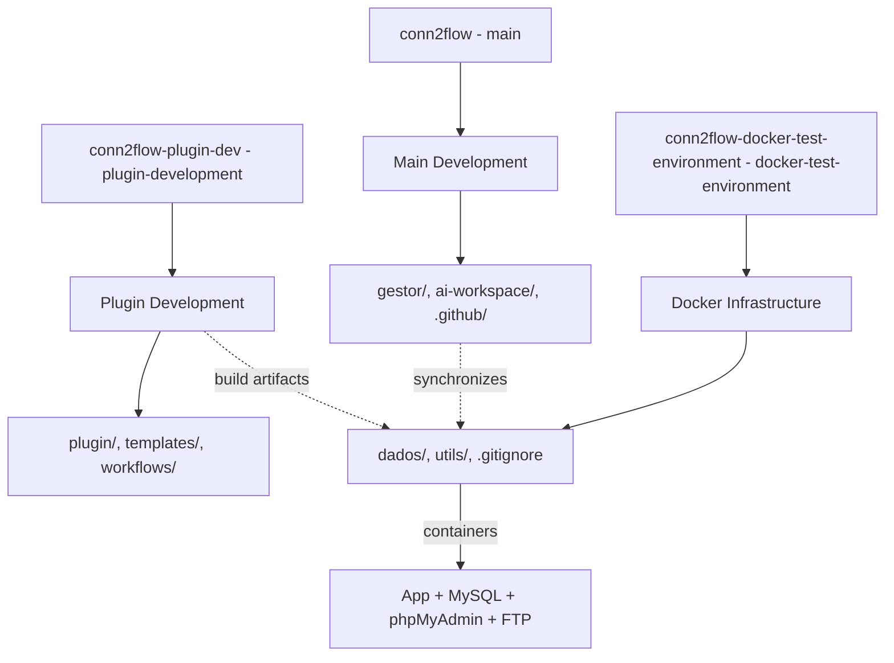

# Manager Development - Legacy 9 (September 2025)

## Focused Objective of This Session
Reorganization of Docker infrastructure and multi-repository synchronization: migration of the Docker environment to a dedicated repository (`conn2flow-docker-test-environment`), documentation update, path adjustments in scripts, and execution of coordinated commits/pushes on three distinct branches (main, plugin-development, docker-test-environment).

## Scope Achieved
- **Physical movement** of the `docker/dados` and `docker/utils` folders from the main repository to the dedicated `conn2flow-docker-test-environment` repository.
- **Update of the main documentation** (`CONN2FLOW-AMBIENTE-DOCKER.md`) to reflect the new external location.
- **Path adjustment** in analysis scripts (`ai-workspace/scripts/arquitetura/*.php`) making `$basePath` dynamic via `realpath()`.
- **Modification of the local build** (`build-local-gestor.sh`) to generate artifacts in the new external repository.
- **Fallback adjustment** in `atualizacoes-sistema.php` to accommodate the new local artifact path.
- **Complete recompilation** of the Docker environment in the new repository with functional containers.
- **Coordinated commits** in the three repositories/branches as requested by the user.
- **Cleanup of files** improperly committed (test data in `dados/sites/`) via `.gitignore` and `git rm --cached`.

## Files / Directories Involved

### Main Repository (conn2flow - main branch)
- `ai-workspace/docs/CONN2FLOW-AMBIENTE-DOCKER.md` - Documentation updated for the new structure
- `ai-workspace/scripts/arquitetura/analyze_missing_data.php` - Dynamic path (`$basePath`)
- `ai-workspace/scripts/arquitetura/analyze_missing_data_v2.php` - Dynamic path (`$basePath`)
- `ai-workspace/scripts/arquitetura/analyze_missing_data_complete.php` - Dynamic path (`$basePath`)
- `ai-workspace/scripts/arquitetura/create_missing_resources.php` - Dynamic path (`$basePath`)
- `ai-workspace/scripts/arquitetura/fix_escaped_quotes_in_resources.php` - Dynamic path (`$basePath`)
- `ai-workspace/scripts/atualizacoes/build-local-gestor.sh` - OUT_DIR redirected to external repo
- `gestor/controladores/atualizacoes/atualizacoes-sistema.php` - Artifact fallback adjusted
- `.vscode/tasks.json` - Partial references adjusted
- **REMOVALS**: `docker/utils/` (migrated), `plugin-skeleton/` (migrated to plugin repo)

### Plugin-Dev Repository (conn2flow-plugin-dev - plugin-development branch)
- Complete structure maintained and synchronized
- Template files, workflow, build scripts
- No significant changes in this session (only synchronization check)

### Docker Repository (conn2flow-docker-test-environment - docker-test-environment branch)
- `dados/` - Complete Docker environment (docker-compose.yml, Dockerfile, sites/)
- `utils/` - Synchronization scripts and utilities
- `.gitignore` - Configured to ignore `dados/sites/` (local test data)

## Problems Encountered & Solutions

| Problem | Cause | Solution |
|---------|-------|---------|
| Outdated documentation | References to old paths `docker/dados/` | Complete update of `CONN2FLOW-AMBIENTE-DOCKER.md` |
| Scripts with hardcoded paths | Fixed `$basePath` in analysis scripts | Replacement with `realpath(__DIR__ . '/../../..')` |
| Local build generating in the wrong place | OUT_DIR pointed to a non-existent folder | Redirection to `../conn2flow-docker-test-environment/dados/sites/localhost/conn2flow-github` |
| "Filename too long" file in git add | Names too long for Windows/Git | Configuration `git config --global core.longpaths true` (suggested) |
| Test data committed improperly | Lack of a proper `.gitignore` | Creation/adjustment of `.gitignore` and removal via `git rm --cached` |
| Containers not working after movement | Need for a complete rebuild | Execution of `docker compose down && docker compose build --pull && docker compose up -d` |

## Critical Command Execution

### 1. Documentation Update
```bash
# File: ai-workspace/docs/CONN2FLOW-AMBIENTE-DOCKER.md
# Changes: Paths updated from docker/dados/ to ../conn2flow-docker-test-environment/dados/
# Multi-domain structure documented with new layout
```

### 2. Dynamic Script Adjustment
```php
// Before (5 files):
$basePath = '/c/Users/otavi/OneDrive/Documentos/GIT/conn2flow';

// After:
$basePath = realpath(__DIR__ . '/../../..');
```

### 3. Local Build Redirected
```bash
# Before:
OUT_DIR="docker/dados/sites/localhost/conn2flow-github"

# After:
OUT_DIR="../conn2flow-docker-test-environment/dados/sites/localhost/conn2flow-github"
```

### 4. Docker Recompilation
```bash
cd ../conn2flow-docker-test-environment/dados
docker compose down
docker compose build --pull
docker compose up -d
docker ps  # Confirmation: 4 active containers
```

### 5. Multi-Repository Commits
```bash
# Main repository (main)
git add -u  # Including intentional deletions
# Result: working tree clean (nothing to commit)

# Plugin repository (plugin-development)
git add -u
# Result: everything up-to-date

# Docker repository (docker-test-environment)
git add .
git rm -r --cached dados/sites/  # Removal of test data
git commit -m "chore: remove dados/sites from the repository, keep only local"
```

## Deliberate Decisions
- **Physical separation** of environments: main code vs. Docker infrastructure vs. plugin development.
- **Maintenance of compatibility** with existing scripts through relative paths.
- **Preservation of local data** in the Docker repository (not versioned after `.gitignore`).
- **No renaming** of containers, volumes, or networks (keep `conn2flow-app`, etc.).
- **Clean removal** of migrated files without improper restoration.

## Final Repository Structure

### conn2flow (main)
```
gestor/                    # Main system
ai-workspace/             # Documentation, scripts, templates
gestor-instalador/        # Web installer
.github/                  # Workflows, chatmodes
.vscode/                  # VSCode Tasks (adjusted)
```

### conn2flow-plugin-dev (plugin-development)
```
plugin/                   # Base plugin
plugin-templates/         # Example templates
tests/build/             # Test artifacts
ai-workspace/git/        # Dedicated git scripts
utils/                   # Plugin utilities
```

### conn2flow-docker-test-environment (docker-test-environment)
```
dados/
├── docker-compose.yml   # Orchestration
├── Dockerfile          # App container
├── sites/              # Multi-domain (LOCAL only)
└── *.conf              # Configurations
utils/
├── sincroniza-*.sh     # Synchronization scripts
└── verificar_dados.php # Diagnostics
```

## Execution Logs (Summarized)

### Docker Compose Build
```
[+] Building 16.5s (12/12) FINISHED
 => dados-app:latest
 => dados-ftp:latest
[+] Running 5/5
 ✓ Network dados_conn2flow-network     Created
 ✓ Container conn2flow-mysql            Started
 ✓ Container conn2flow-app              Started
 ✓ Container conn2flow-phpmyadmin       Started
 ✓ Container conn2flow-ftp              Started
```

### Final Container Status
```
CONTAINER ID   IMAGE         PORTS                           NAMES
[...]          dados-app     0.0.0.0:80->80/tcp             conn2flow-app
[...]          mysql:8.0     0.0.0.0:3306->3306/tcp         conn2flow-mysql
[...]          phpmyadmin    0.0.0.0:8081->80/tcp           conn2flow-phpmyadmin
[...]          dados-ftp     0.0.0.0:21->21/tcp,21100-21110 conn2flow-ftp
```

## Delivery Checklist (Session)
- [x] Physical migration of docker/ to external repository
- [x] Documentation update with new paths
- [x] Adjustment of 5 scripts for dynamic paths
- [x] Redirection of build-local to new location
- [x] Artifact fallback in atualizacoes-sistema.php
- [x] Docker recompilation in the new repository
- [x] Functional containers (4/4 UP)
- [x] Coordinated commits/pushes on the 3 branches
- [x] Cleanup of test data via .gitignore
- [x] Removal of improperly committed files

## Multi-Repository Architecture (Final State)



## Benefits of the Reorganization
- **Clear isolation** of responsibilities (code vs. infra vs. plugin).
- **Independent synchronization** between repositories.
- **Local test data** does not pollute Git history.
- **Scalability** for multiple Docker environments.
- **Facilitated maintenance** with updated documentation.

## Identified Risks / Limitations
- **Dependency on relative paths** between repositories (folder structure must be maintained).
- **Manual synchronization** between repos (not automated via Git hooks).
- **.gitignore** must be kept updated to avoid commits of local data.
- **Long paths** on Windows may require additional Git configuration.

## Suggested Next Steps
1. **Document workflow** of multi-repo synchronization in `ai-workspace/docs/`.
2. **Automate synchronization** via scripts or GitHub Actions.
3. **Validate local builds** in the new environment.
4. **Test database updates** with the new layout.
5. **Create a backup** of critical Docker configurations.
6. **Standardize .gitignore** between repositories where applicable.

## Final Validation Commands
```bash
# Check Docker containers
docker ps

# Test manager synchronization
cd ../conn2flow-docker-test-environment/utils/
bash sincroniza-gestor.sh checksum

# Validate local build
cd ../conn2flow/
bash ai-workspace/scripts/atualizacoes/build-local-gestor.sh

# Confirm artifact in the new location
ls -la ../conn2flow-docker-test-environment/dados/sites/localhost/conn2flow-github/
```

## Differences vs. Previous Session (Legacy 8)
| Aspect | Legacy 8 | Legacy 9 |
|---------|----------|----------|
| Focus | Plugin DB scripts | Multi-repo infra |
| Scope | Line-by-line adaptation | Physical reorganization |
| Files | 1 main script | 10+ various files |
| Tests | Container dry-run | Complete Docker rebuild |
| Result | Functional script | 3 synchronized repos |

## Generated Commit Messages
```bash
# Main repo (theoretically - working tree clean):
# "docs(docker): update reference to external repository
#  chore: remove migrated docker/utils and plugin-skeleton directories
#  chore(scripts): dynamic paths and adjusted build-local
#  refactor(update): local artifact fallback and adjusted tasks"

# Docker repo:
# "chore: remove dados/sites from the repository, keep only local (test data)"

# Plugin repo:
# Everything up-to-date (no changes)
```

## Continuity Context
This session established the **definitive multi-repository infrastructure** for the Conn2Flow project, clearly separating the main code, plugin development, and Docker environment. The next session can focus on:
- Development of specific features
- Integration tests in the new environment
- Automatic synchronization improvements
- Expansion of the plugin system

## Conclusion
The session fully accomplished the requested reorganization, successfully migrating the Docker environment to a dedicated repository, updating all relevant documentation and scripts, and maintaining the full functionality of the system through a rebuild and validation of the containers. The result is a cleaner, more scalable, and organizationally superior architecture, ready for future developments.

_Session concluded. Context preserved for continuity (Legacy 9)._
