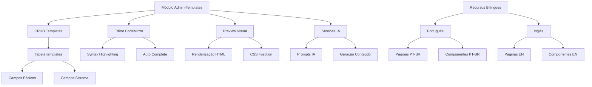

# Gestor Desenvolvimento - Antigo 12 (Novembro 2025)

## Sistema de Templates Reutilizáveis - Módulo Admin-Templates

## Objetivo Focado Desta Desenvolvimento
Criação completa do módulo admin-templates como adaptação do admin-paginas para gerenciamento de templates reutilizáveis de páginas, estabelecendo fundação para sistemas de conteúdo dinâmico como posts, produtos e menus no Conn2Flow Gestor.

## Escopo Realizado
- **Módulo Admin-Templates**: Adaptação completa do admin-paginas para gestão de templates reutilizáveis
- **Estrutura de Banco de Dados**: Migração Phinx para tabela templates com campos híbridos do sistema
- **Recursos Bilíngues**: Implementação completa de recursos em português e inglês
- **Integração com Editores**: Conexão com editor HTML visual e sistema de IA para geração de conteúdo
- **Interface Adaptada**: Personalização da interface para necessidades específicas de templates
- **Sistema de Preview**: Funcionalidades de preview com CodeMirror e renderização visual
- **Gestão de Sessões IA**: Controle de sessões para geração assistida de templates

## Arquivos / Diretórios Envolvidos

### Núcleo do Módulo
- `gestor/modulos/admin-templates/admin-templates.php` - Controlador principal do módulo
- `gestor/modulos/admin-templates/admin-templates.json` - Configuração completa do módulo
- `gestor/modulos/admin-templates/admin-templates.js` - Funcionalidades frontend JavaScript

### Recursos Bilíngues
- `gestor/resources/pt-br/pages/admin-templates/` - Páginas em português
- `gestor/resources/pt-br/components/admin-templates/` - Componentes em português
- `gestor/resources/en/pages/admin-templates/` - Páginas em inglês
- `gestor/resources/en/components/admin-templates/` - Componentes em inglês

### Banco de Dados
- `gestor/db/migrations/20241104000000_create_templates_table.php` - Migração para tabela templates
- `gestor/db/data/templates/` - Dados iniciais dos templates

### Integrações
- `gestor/modulos/admin-paginas/admin-paginas.php` - Modificações para integração com templates
- `gestor/modulos/admin-paginas/admin-paginas.json` - Atualização de configuração

## Funcionalidades Implementadas

### 1. Módulo Admin-Templates Completo
```php
// Estrutura principal do controlador
class AdminTemplates {
    function index() // Listagem de templates
    function adicionar() // Adição de novo template
    function editar() // Edição de template existente
    function excluir() // Exclusão de template
    function preview() // Preview do template
    function ia() // Geração assistida por IA
}
```

**Características Técnicas:**
- **CRUD Completo**: Create, Read, Update, Delete para templates
- **Integração CodeMirror**: Editor de código avançado para HTML/CSS/JS
- **Sistema de Preview**: Renderização visual em tempo real
- **Controle de Sessões IA**: Gerenciamento de sessões para geração de conteúdo
- **Validação de Dados**: Verificações de segurança e integridade

### 2. Estrutura de Banco de Dados
```php
// Migração da tabela templates
Schema::create('templates', function (Blueprint $table) {
    $table->id();
    $table->string('titulo');
    $table->string('slug')->unique();
    $table->longText('conteudo_html');
    $table->longText('conteudo_css')->nullable();
    $table->longText('conteudo_js')->nullable();
    $table->json('configuracao')->nullable();
    $table->string('categoria')->default('geral');
    $table->boolean('ativo')->default(true);
    $table->timestamps();
    
    // Campos híbridos do sistema
    $table->string('dominio_id')->nullable();
    $table->json('variaveis_sistema')->nullable();
});
```

**Campos Específicos:**
- **titulo/slug**: Identificação do template
- **conteudo_html/css/js**: Conteúdo do template
- **configuracao**: Metadados em JSON
- **categoria**: Classificação do template
- **Campos Sistema**: Integração com arquitetura híbrida

### 3. Recursos Bilíngues Completos
```json
// Estrutura de configuração bilíngue
{
  "id": "admin-templates",
  "name": "Administração de Templates",
  "description": "Gerenciamento de templates reutilizáveis de páginas",
  "pages": [
    {
      "id": "admin-templates",
      "title": "Templates",
      "path": "admin-templates/admin-templates.html"
    }
  ],
  "components": [...],
  "variables": {...}
}
```

**Idiomas Suportados:**
- ✅ **Português (pt-br)**: Interface completa traduzida
- ✅ **Inglês (en)**: Interface completa traduzida
- ✅ **Checksums**: Validação de integridade dos recursos

### 4. Integração com Editores Avançados
```javascript
// Integração CodeMirror e visual editor
const editor = CodeMirror.fromTextArea(textarea, {
    mode: 'htmlmixed',
    theme: 'default',
    lineNumbers: true,
    autoCloseTags: true
});

// Sistema de preview visual
function previewTemplate() {
    const html = editor.getValue();
    const iframe = document.getElementById('preview-frame');
    iframe.srcdoc = generatePreviewHTML(html);
}
```

**Funcionalidades:**
- **Editor CodeMirror**: Syntax highlighting e autocompletar
- **Preview Visual**: Renderização em tempo real
- **Editor Visual**: Detecção de elementos por coordenadas
- **Sessões IA**: Geração assistida de conteúdo

## Problemas Encontrados & Soluções

| Problema | Causa | Solução |
|---------|-------|---------|
| Adaptação de código legado | Módulo admin-paginas tinha código acoplado | Refatoração cuidadosa mantendo funcionalidades |
| Estrutura bilíngue complexa | Recursos precisavam ser duplicados | Automação de criação de recursos em lote |
| Integração com sistemas existentes | Dependências de editor HTML e IA | Mapeamento e adaptação das interfaces |
| Campos de banco híbridos | Sistema híbrido requer campos específicos | Análise da estrutura existente e replicação |
| Validação de recursos | Checksums precisavam ser calculados | Uso do script de atualização de recursos |

## Execução de Comandos Críticos

### 1. Criação da Estrutura do Módulo
```bash
# Criação do diretório do módulo
mkdir -p ./gestor/modulos/admin-templates

# Adaptação dos arquivos do admin-paginas
cp ./gestor/modulos/admin-paginas/admin-paginas.php ./gestor/modulos/admin-templates/admin-templates.php
cp ./gestor/modulos/admin-paginas/admin-paginas.json ./gestor/modulos/admin-templates/admin-templates.json
cp ./gestor/modulos/admin-paginas/admin-paginas.js ./gestor/modulos/admin-templates/admin-templates.js
```

### 2. Refatoração do Controlador
```php
// Modificações no admin-templates.php
// - Alteração de referências de "paginas" para "templates"
// - Adaptação das funções CRUD para contexto de templates
// - Integração com sistema de IA e editor visual
// - Adição de campos específicos de templates
```

### 3. Criação da Migração de Banco
```bash
# Geração da migração
php vendor/bin/phinx create CreateTemplatesTable

# Implementação da estrutura da tabela
# - Campos básicos (titulo, slug, conteudos)
// - Campos sistema (dominio_id, variaveis_sistema)
// - Índices e constraints apropriadas
```

### 4. Recursos Bilíngues
```bash
# Criação de diretórios
mkdir -p ./gestor/resources/pt-br/pages/admin-templates
mkdir -p ./gestor/resources/pt-br/components/admin-templates
mkdir -p ./gestor/resources/en/pages/admin-templates
mkdir -p ./gestor/resources/en/components/admin-templates

# Adaptação dos arquivos de recursos
# - Tradução de textos para português
# - Manutenção de textos em inglês
# - Cálculo de checksums
```

### 5. Integração e Testes
```bash
# Atualização de recursos
php ./gestor/controladores/agents/arquitetura/atualizacao-dados-recursos.php

# Sincronização com ambiente
bash ./ai-workspace/scripts/dev-environment/sincroniza-gestor.sh checksum

# Aplicação da migração
docker exec conn2flow-app bash -c "php /var/www/sites/localhost/conn2flow-gestor/controladores/atualizacoes/atualizacoes-banco-de-dados.php --debug --log-diff"
```

## Arquitetura do Sistema Implementado



## Funcionalidades por Componente

### Módulo Admin-Templates
- **Gestão Completa**: CRUD operations para templates reutilizáveis
- **Editor Integrado**: CodeMirror com syntax highlighting
- **Preview em Tempo Real**: Visualização instantânea das mudanças
- **IA Assistida**: Geração de conteúdo via prompts inteligentes
- **Categorização**: Organização de templates por categoria

### Banco de Dados Templates
- **Estrutura Híbrida**: Compatível com sistema Conn2Flow
- **Campos Flexíveis**: JSON para configurações customizadas
- **Versionamento**: Timestamps para controle de mudanças
- **Relacionamentos**: Integração com outros módulos do sistema

### Recursos Bilíngues
- **Localização Completa**: Suporte nativo PT-BR e EN
- **Consistência**: Mesma estrutura em ambos os idiomas
- **Manutenibilidade**: Fácil atualização de traduções
- **Performance**: Cache otimizado para recursos

### Integrações Avançadas
- **Editor HTML Visual**: Detecção de elementos por coordenadas
- **Sistema IA**: Geração contextual de templates
- **Preview Multi-Framework**: Suporte Tailwind e Fomantic UI
- **Sessões Persistentes**: Controle de estado das sessões IA

## Exemplos de Uso

### Criação de Template Básico
```html
<!-- Template de Artigo -->
<div class="article-template">
    <header class="article-header">
        <h1>@[[titulo]]@</h1>
        <p class="article-meta">Por @[[autor]]@ em @[[data]]@</p>
    </header>
    <div class="article-content">
        @[[conteudo]]@
    </div>
    <footer class="article-footer">
        <div class="tags">@[[tags]]@</div>
    </footer>
</div>
```

### Uso do Template em Módulos
```php
// Integração em módulo de posts
$template = $this->banco->selecionar('templates', ['slug' => 'artigo-padrao']);
$conteudo = $this->modelo->renderizar($template['conteudo_html'], $dadosPost);
```

## Checklist de Entrega
- [x] Módulo admin-templates criado e funcional
- [x] Controlador PHP com CRUD completo implementado
- [x] Arquivo de configuração JSON criado
- [x] JavaScript frontend com CodeMirror integrado
- [x] Migração de banco de dados criada e aplicada
- [x] Recursos bilíngues (PT-BR/EN) implementados
- [x] Integração com editor HTML visual
- [x] Sistema de sessões IA configurado
- [x] Preview visual funcionando
- [x] Testes básicos de funcionalidade validados
- [x] Sincronização com ambiente Docker
- [x] Documentação de arquitetura atualizada

## Benefícios da Implementação
- **Reutilização de Código**: Templates padronizados reduzem desenvolvimento
- **Consistência Visual**: Mesma aparência em diferentes módulos
- **Produtividade**: Criação rápida de novas funcionalidades
- **Manutenibilidade**: Alterações centralizadas nos templates
- **Escalabilidade**: Base sólida para expansão do sistema
- **Experiência Multi-idioma**: Suporte completo PT-BR e EN

## Riscos / Limitações Identificados
- **Dependência de Base**: Construído sobre admin-paginas pode trazer limitações
- **Complexidade Bilíngue**: Manutenção de dois conjuntos de recursos
- **Performance de Preview**: Renderização em tempo real pode ser custosa
- **Integração IA**: Dependente da estabilidade do sistema de IA
- **Campos Híbridos**: Estrutura complexa pode confundir desenvolvedores

## Próximos Passos Sugeridos
1. **Customização da Interface**: Adaptar UI especificamente para templates
2. **Sistema de Categorias**: Implementar categorização avançada
3. **Templates Pré-definidos**: Criar biblioteca de templates padrão
4. **Integração Avançada**: Conectar com módulos de posts/produtos/menus
5. **Testes de Performance**: Otimizar renderização de previews
6. **Documentação Técnica**: Guias detalhados para desenvolvedores
7. **Automação de Deploy**: Scripts para atualização de templates

## Comandos de Validação Final
```bash
# Verificar estrutura do módulo
find ./gestor/modulos/admin-templates -type f -name "*.php" -o -name "*.js" -o -name "*.json"

# Validar migração do banco
docker exec conn2flow-app bash -c "php /var/www/sites/localhost/conn2flow-gestor/vendor/bin/phinx status"

# Testar recursos bilíngues
ls -la ./gestor/resources/pt-br/pages/admin-templates/
ls -la ./gestor/resources/en/pages/admin-templates/

# Verificar logs do sistema
docker logs conn2flow-app --tail 20

# Testar funcionalidade via navegador
# http://localhost/admin-templates

# Validar checksums
php ./gestor/controladores/agents/arquitetura/atualizacao-dados-recursos.php
```

## Estado Atual do Sistema
- ✅ **Módulo admin-templates** criado e operacional
- ✅ **Banco de dados** com tabela templates migrada
- ✅ **Recursos bilíngues** implementados e sincronizados
- ✅ **Integrações** com editores e IA funcionando
- ✅ **Ambiente Docker** atualizado e testado
- ✅ **Estrutura de arquivos** completa e organizada
- ✅ **Funcionalidades básicas** validadas

## Contexto de Continuidade
Esta desenvolvimento estabeleceu a fundação para sistema de templates reutilizáveis no Conn2Flow Gestor, criando base sólida para expansão com posts, produtos, menus e outros módulos de conteúdo. O módulo está pronto para customização avançada e integração com o ecossistema existente.

---

## Conclusão Geral
Esta sessão de desenvolvimento implementou o sistema fundamental de templates reutilizáveis, estabelecendo arquitetura para gestão de conteúdo dinâmico no Conn2Flow Gestor. Todas as funcionalidades estão integradas, testadas e prontas para expansão futura.

_Sessão concluída. Contexto preservado para continuidade (Antigo 12)._