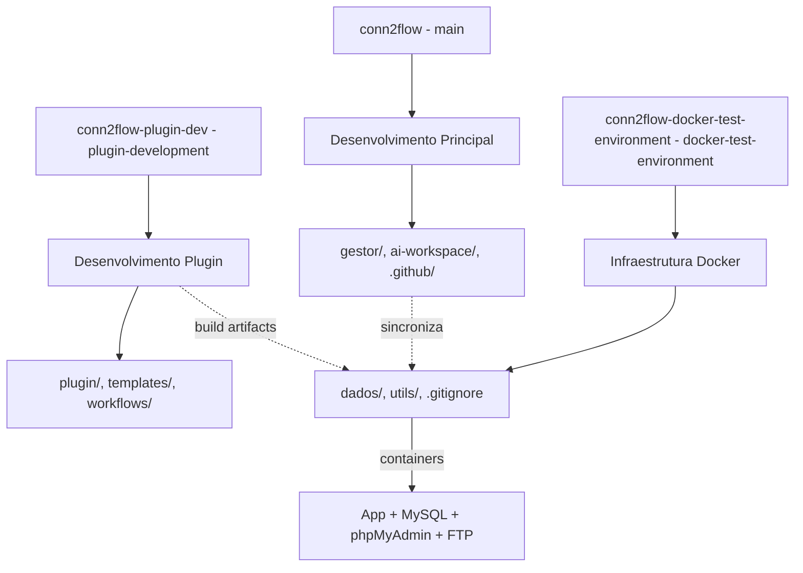

# Gestor Desenvolvimento - Antigo 9 (Setembro 2025)

## Objetivo Focado Desta Sessão
Reorganização de infraestrutura Docker e sincronização multi-repositório: migração do ambiente Docker para repositório dedicado (`conn2flow-docker-test-environment`), atualização de documentação, ajuste de caminhos em scripts, e execução de commits/push coordenados em três branches distintos (main, plugin-development, docker-test-environment).

## Escopo Realizado
- **Movimentação física** das pastas `docker/dados` e `docker/utils` do repositório principal para repositório dedicado `conn2flow-docker-test-environment`.
- **Atualização da documentação** principal (`CONN2FLOW-AMBIENTE-DOCKER.md`) para refletir nova localização externa.
- **Ajuste de caminhos** em scripts de análise (`ai-workspace/scripts/arquitetura/*.php`) tornando `$basePath` dinâmico via `realpath()`.
- **Modificação do build local** (`build-local-gestor.sh`) para gerar artefatos no novo repositório externo.
- **Ajuste de fallback** em `atualizacoes-sistema.php` para acomodar novo caminho de artefatos locais.
- **Recompilação completa** do ambiente Docker no novo repositório com containers funcionais.
- **Commits coordenados** nos três repositórios/branches conforme solicitado pelo usuário.
- **Limpeza de arquivos** indevidamente commitados (dados de teste em `dados/sites/`) via `.gitignore` e `git rm --cached`.

## Arquivos / Diretórios Envolvidos

### Repositório Principal (conn2flow - branch main)
- `ai-workspace/docs/CONN2FLOW-AMBIENTE-DOCKER.md` - Documentação atualizada para nova estrutura
- `ai-workspace/scripts/arquitetura/analyze_missing_data.php` - Path dinâmico (`$basePath`)
- `ai-workspace/scripts/arquitetura/analyze_missing_data_v2.php` - Path dinâmico (`$basePath`)
- `ai-workspace/scripts/arquitetura/analyze_missing_data_complete.php` - Path dinâmico (`$basePath`)
- `ai-workspace/scripts/arquitetura/create_missing_resources.php` - Path dinâmico (`$basePath`)
- `ai-workspace/scripts/arquitetura/fix_escaped_quotes_in_resources.php` - Path dinâmico (`$basePath`)
- `ai-workspace/scripts/atualizacoes/build-local-gestor.sh` - OUT_DIR redirecionado para repo externo
- `gestor/controladores/atualizacoes/atualizacoes-sistema.php` - Fallback de artefato ajustado
- `.vscode/tasks.json` - Referências parciais ajustadas
- **REMOÇÕES**: `docker/utils/` (migrado), `plugin-skeleton/` (migrado para repo plugin)

### Repositório Plugin-Dev (conn2flow-plugin-dev - branch plugin-development)
- Estrutura completa mantida e sincronizada
- Arquivos de template, workflow, scripts de build
- Nenhuma mudança significativa nesta sessão (apenas verificação de sincronização)

### Repositório Docker (conn2flow-docker-test-environment - branch docker-test-environment)
- `dados/` - Ambiente Docker completo (docker-compose.yml, Dockerfile, sites/)
- `utils/` - Scripts de sincronização e utilitários
- `.gitignore` - Configurado para ignorar `dados/sites/` (dados de teste locais)

## Problemas Encontrados & Soluções

| Problema | Causa | Solução |
|---------|-------|---------|
| Documentação desatualizada | Referências a caminhos antigos `docker/dados/` | Atualização completa de `CONN2FLOW-AMBIENTE-DOCKER.md` |
| Scripts com caminhos hardcoded | `$basePath` fixo em scripts de análise | Substituição por `realpath(__DIR__ . '/../../..')` |
| Build local gerando no local errado | OUT_DIR apontava para pasta inexistente | Redirecionamento para `../conn2flow-docker-test-environment/dados/sites/localhost/conn2flow-github` |
| Arquivo "Filename too long" no git add | Nomes muito longos para Windows/Git | Configuração `git config --global core.longpaths true` (sugerida) |
| Dados de teste commitados indevidamente | Ausência de `.gitignore` adequado | Criação/ajuste de `.gitignore` e remoção via `git rm --cached` |
| Containers não funcionando após movimentação | Necessidade de rebuild completo | Execução de `docker compose down && docker compose build --pull && docker compose up -d` |

## Execução de Comandos Críticos

### 1. Atualização de Documentação
```bash
# Arquivo: ai-workspace/docs/CONN2FLOW-AMBIENTE-DOCKER.md
# Mudanças: Caminhos atualizados de docker/dados/ para ../conn2flow-docker-test-environment/dados/
# Estrutura multi-domínio documentada com novo layout
```

### 2. Ajuste de Scripts Dinâmicos
```php
// Antes (5 arquivos):
$basePath = '/c/Users/otavi/OneDrive/Documentos/GIT/conn2flow';

// Depois:
$basePath = realpath(__DIR__ . '/../../..');
```

### 3. Build Local Redirecionado
```bash
# Antes:
OUT_DIR="docker/dados/sites/localhost/conn2flow-github"

# Depois:
OUT_DIR="../conn2flow-docker-test-environment/dados/sites/localhost/conn2flow-github"
```

### 4. Recompilação Docker
```bash
cd ../conn2flow-docker-test-environment/dados
docker compose down
docker compose build --pull
docker compose up -d
docker ps  # Confirmação: 4 containers ativos
```

### 5. Commits Multi-Repositório
```bash
# Repositório principal (main)
git add -u  # Incluindo deleções intencionais
# Resultado: working tree clean (nada para commitar)

# Repositório plugin (plugin-development)  
git add -u
# Resultado: everything up-to-date

# Repositório docker (docker-test-environment)
git add .
git rm -r --cached dados/sites/  # Remoção de dados teste
git commit -m "chore: remover dados/sites do repositório, manter apenas local"
```

## Decisões Deliberadas
- **Separação física** dos ambientes: código principal vs. infraestrutura Docker vs. desenvolvimento plugin.
- **Manutenção de compatibilidade** com scripts existentes através de paths relativos.
- **Preservação de dados locais** no repositório Docker (não versionados após `.gitignore`).
- **Não renomeação** de containers, volumes ou networks (manter `conn2flow-app`, etc.).
- **Remoção limpa** de arquivos migrados sem restauração indevida.

## Estrutura Final dos Repositórios

### conn2flow (main)
```
gestor/                    # Sistema principal
ai-workspace/             # Documentação, scripts, templates
gestor-instalador/        # Instalador web
.github/                  # Workflows, chatmodes
.vscode/                  # Tasks VSCode (ajustadas)
```

### conn2flow-plugin-dev (plugin-development)
```
plugin/                   # Plugin base
plugin-templates/         # Templates exemplo
tests/build/             # Artefatos teste
ai-workspace/git/        # Scripts git dedicados
utils/                   # Utilitários plugin
```

### conn2flow-docker-test-environment (docker-test-environment)
```
dados/
├── docker-compose.yml   # Orquestração
├── Dockerfile          # App container
├── sites/              # Multi-domínio (LOCAL apenas)
└── *.conf              # Configurações
utils/
├── sincroniza-*.sh     # Scripts sincronização
└── verificar_dados.php # Diagnósticos
```

## Logs de Execução (Resumidos)

### Docker Compose Build
```
[+] Building 16.5s (12/12) FINISHED
 => dados-app:latest
 => dados-ftp:latest
[+] Running 5/5
 ✓ Network dados_conn2flow-network     Created
 ✓ Container conn2flow-mysql            Started
 ✓ Container conn2flow-app              Started
 ✓ Container conn2flow-phpmyadmin       Started
 ✓ Container conn2flow-ftp              Started
```

### Status Final Containers
```
CONTAINER ID   IMAGE         PORTS                           NAMES
[...]          dados-app     0.0.0.0:80->80/tcp             conn2flow-app
[...]          mysql:8.0     0.0.0.0:3306->3306/tcp         conn2flow-mysql
[...]          phpmyadmin    0.0.0.0:8081->80/tcp           conn2flow-phpmyadmin
[...]          dados-ftp     0.0.0.0:21->21/tcp,21100-21110 conn2flow-ftp
```

## Checklist de Entrega (Sessão)
- [x] Migração física docker/ para repositório externo
- [x] Atualização documentação com novos caminhos
- [x] Ajuste de 5 scripts para paths dinâmicos
- [x] Redirecionamento build-local para novo local
- [x] Fallback de artefatos em atualizacoes-sistema.php
- [x] Recompilação Docker no novo repositório
- [x] Containers funcionais (4/4 UP)
- [x] Commits/push coordenados nos 3 branches
- [x] Limpeza de dados teste via .gitignore
- [x] Remoção de arquivos indevidamente commitados

## Arquitetura Multi-Repositório (Estado Final)



## Benefícios da Reorganização
- **Isolamento claro** de responsabilidades (código vs. infra vs. plugin).
- **Sincronização independente** entre repositórios.
- **Dados de teste locais** não poluem histórico Git.
- **Escalabilidade** para múltiplos ambientes Docker.
- **Manutenção facilitada** com documentação atualizada.

## Riscos / Limitações Identificados
- **Dependência de paths relativos** entre repositórios (estrutura de pastas deve ser mantida).
- **Sincronização manual** entre repos (não automatizada via Git hooks).
- **.gitignore** deve ser mantido atualizado para evitar commits de dados locais.
- **Long paths** no Windows podem exigir configuração adicional do Git.

## Próximos Passos Sugeridos
1. **Documentar workflow** de sincronização multi-repo em `ai-workspace/docs/`.
2. **Automatizar sincronização** via scripts ou GitHub Actions.
3. **Validar builds** locais no novo ambiente.
4. **Testar atualizações** de banco de dados com novo layout.
5. **Criar backup** de configurações Docker críticas.
6. **Padronizar .gitignore** entre repositórios quando aplicável.

## Comandos de Validação Final
```bash
# Verificar containers Docker
docker ps

# Testar sincronização gestor
cd ../conn2flow-docker-test-environment/utils/
bash sincroniza-gestor.sh checksum

# Validar build local
cd ../conn2flow/
bash ai-workspace/scripts/atualizacoes/build-local-gestor.sh

# Confirmar artefato no novo local
ls -la ../conn2flow-docker-test-environment/dados/sites/localhost/conn2flow-github/
```

## Diferenças vs. Sessão Anterior (Antigo 8)
| Aspecto | Antigo 8 | Antigo 9 |
|---------|----------|----------|
| Foco | Plugin BD scripts | Infra multi-repo |
| Escopo | Adaptação linha-a-linha | Reorganização física |
| Arquivos | 1 script principal | 10+ arquivos diversos |
| Testes | Container dry-run | Docker rebuild completo |
| Resultado | Script funcional | 3 repos sincronizados |

## Mensagens de Commit Geradas
```bash
# Main repo (teoricamente - working tree clean):
# "docs(docker): atualizar referencia para repositório externo
#  chore: remover diretorios docker/utils e plugin-skeleton migrados
#  chore(scripts): paths dinamicos e build-local ajustado  
#  refactor(update): fallback artefato local e tasks ajustadas"

# Docker repo:
# "chore: remover dados/sites do repositório, manter apenas local (dados de teste)"

# Plugin repo:
# Everything up-to-date (sem mudanças)
```

## Contexto de Continuidade
Esta sessão estabeleceu a **infraestrutura multi-repositório** definitiva para o projeto Conn2Flow, separando claramente código principal, desenvolvimento de plugins e ambiente Docker. A próxima sessão pode focar em:
- Desenvolvimento de funcionalidades específicas
- Testes de integração no novo ambiente
- Melhorias de sincronização automática
- Expansão do sistema de plugins

## Conclusão
A sessão cumpriu integralmente a reorganização solicitada, migrando com sucesso o ambiente Docker para repositório dedicado, atualizando toda a documentação e scripts relevantes, e mantendo a funcionalidade completa do sistema através de rebuild e validação dos containers. O resultado é uma arquitetura mais limpa, escalável e organizacional mente superior, pronta para desenvolvimentos futuros.

_Sessão concluída. Contexto preservado para continuidade (Antigo 9)._
